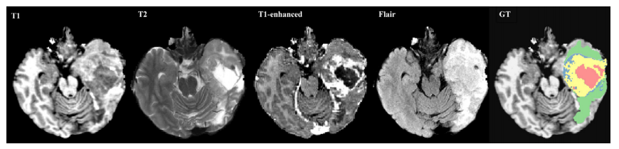
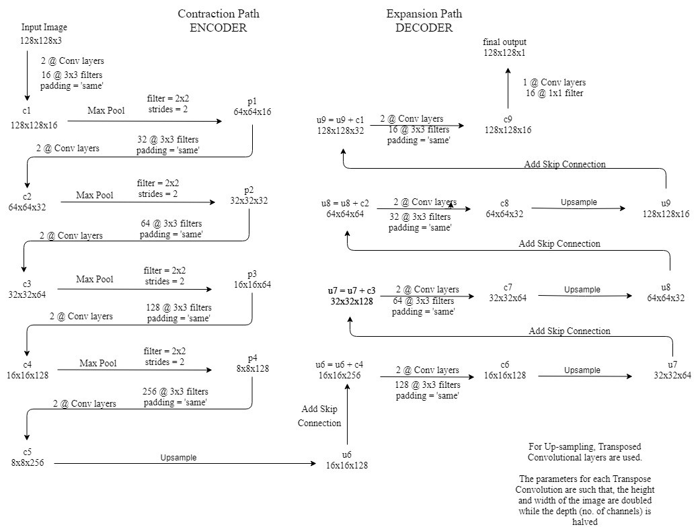
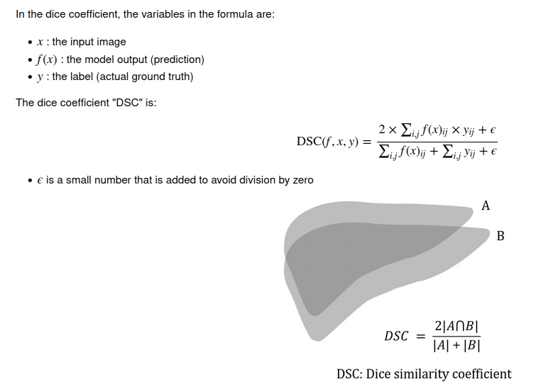
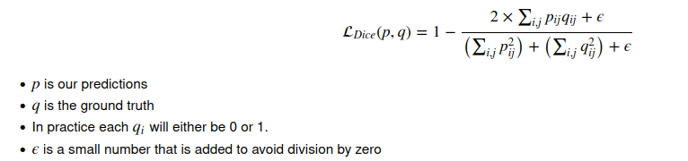
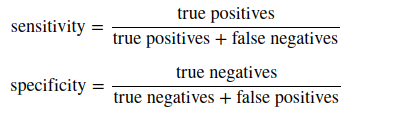
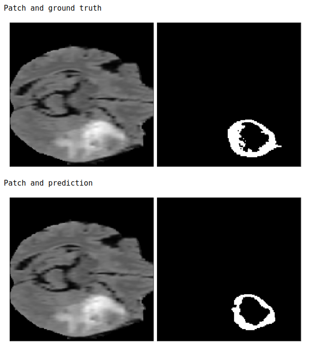
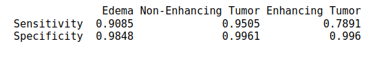
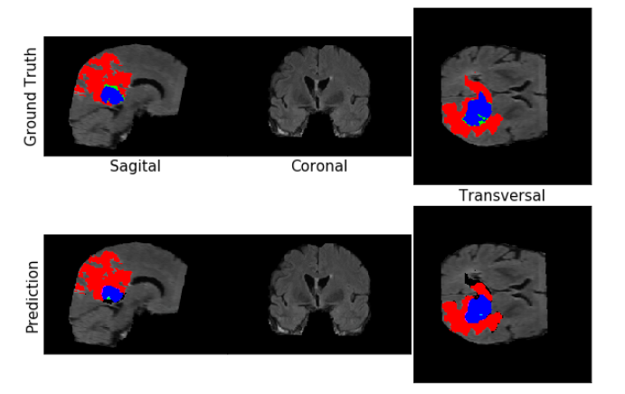
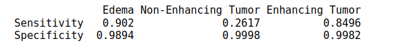

# Brain tumor segmentation using MRI

# Project description
- The objective of the project is to use deep learning to diagnose tumor from MRI images.
- The project uses a 3D U-Net model able to diagnose 4 labels - background, edema, enhancing tumor and non-enhancing tumor.
- Soft dice loss is used as loss-function to optimize and offset the low performance of other traditonal optimizers due to heavy class imbalance.
- The predictions are done on patch level for a sub volume of the MRI. Finally, we combine the result of patches to obtain a full MRI scan result.

# What is an MRI?
Magnetic resonance imaging (MRI) is an advanced imaging technique that is used to observe a variety of diseases and parts of the body.
Neural networks can analyze these images individually (as a radiologist would) or combine them into a single 3D volume to make predictions.
At a high level, MRI works by measuring the radio waves emitting by atoms subjected to a magnetic field. 
We have built a multiclass segmentation model which identifies 3 abnormalities in an image: Edemas, non-enhancing tumors and enhancing tumors.

# Data preprocessing:
- In this project, I would be using data from the [Decathlon 10 challenge](https://decathlon-10.grand-challenge.org/)
- The dataset is stored in the [NifTI-1 format](https://nifti.nimh.nih.gov/nifti-1/) and we will be using the [NiBabel library](https://github.com/nipy/nibabel) to interact with the files. Each training sample is composed of two separate files:
- The first file is an image file containing a 4D array of MR image in the shape of (240, 240, 155, 4). The second file in each training example is a label file containing a 3D array with the shape of (240, 240, 155). 
- The integer values in this array indicate the "label" for each voxel in the corresponding image files:
  - 0: Background. 
  - 1: Edema.
  - 2: Non-enhancing tumor.
  - 3: Enhancing tumor.
- First generate "patches" of our data which you can think of as sub-volumes of the whole MR images. 
- The reason that we are generating patches is because a network that can process the entire volume at once will simply not fit inside our current environment's memory. Therefore we will be using this common technique to generate spatially consistent sub-volumes of our data, which can be fed into our network.
- Specifically, I generated randomly sampled sub-volumes of shape [160, 160, 16] from the images.
- Given that the values in MR images cover a very wide range, standardize the values to have a mean of zero and standard deviation of 1.
- The color corresponds to each class:
  - Red is edema.
  - Blue is enhancing tumor.
  - Green is non enhancing tumor.

# U-Net highlights:
- U-Net is a convolutional neural network that was developed for biomedical image segmentation at the Computer Science Department of the University of Freiburg The network is based on the fully convolutional network and its architecture was modified and extended to work with fewer training images and to yield more precise segmentations.
- U-Net was created by Olaf Ronneberger, Philipp Fischer, Thomas Brox in 2015 at the paper [“U-Net: Convolutional Networks for Biomedical Image Segmentation"](https://arxiv.org/pdf/1505.04597.pdf) It's an improvement and development of FCN: Evan Shelhamer, Jonathan Long, Trevor Darrell (2014). ["Fully convolutional networks for semantic segmentation"](https://arxiv.org/pdf/1411.4038.pdf)
- The architecture contains two paths. First path is the contraction path (also called as the encoder) which is used to capture the context in the image. The encoder is just a traditional stack of convolutional and max pooling layers. The second path is the symmetric expanding path (also called as the decoder) which is used to enable precise localization using transposed convolutions.
- Thus it is an end-to-end fully convolutional network (FCN), i.e. it only contains Convolutional layers and does not contain any Dense layer because of which it can accept image of any size.

Detailed U-Net architectured as described in the paper.

# 3D U-Net model:
- The U-Net model implemented here has a depth of 4. This implies that the model will have 4 contracting(analysis) paths and 4 expanding(synthesis) paths.
- In the contracting path, each layer contains two 3x3x3 convolutions each followed by a ReLU, and then a 2x2x2 maxpooling(except the last layer).
- In the expanding path, each layer consists of an up-convolution of 2×2×2, followed by two 3×3×3 convolutions each followed by a ReLU.
- Shortcut connections from layers of equal resolution in the analysis path provide the essential high-resolution features to the synthesis path.
- In the last layer, a 1×1×1 convolution reduces the number of output channels to the number of labels which is 3, followed by a sigmoid activation layer.

# Metrics:
### Dice Similarity Coefficient 
- Aside from the architecture, one of the most important elements of any deep learning method is the choice of our loss function.A natural choice that you may be familiar with is the cross-entropy loss function.However, this loss function is not ideal for segmentation tasks due to heavy class imbalance (there are typically not many positive regions).
- A much more common loss for segmentation tasks is the Dice similarity coefficient, which is a measure of how well two contours overlap. 

  

### Soft Dice Loss
- The model outputs probabilities that each pixel is, say, a tumor or not, and we want to be able to backpropagate through those outputs.
Therefore, we need an analogue of the Dice loss which takes real valued input. This is where the Soft Dice loss comes in. The formula is:

  

### Sensitivity and Specificity:
- The model covers some of the relevant areas, but it's definitely not perfect.
To quantify its performance, we can use per-pixel sensitivity and specificity.
Recall that in terms of the true positives, true negatives, false positives, and false negatives.

  

# Results:
### Patch level predictions:

### Whole scan predictions:
- As of now, our model just runs on patches, but what we really want to see is our model's result on a whole MRI scan. 
- To do this, generate patches for the scan, then we run the model on the patches and combine the results together to get a fully labeled MR image.

