# AI-FOR-HEALTHCARE

## Table of contents
- [AI-for-healthcare](#ai_for_healthcare)
  - [Table of contents](#table-of-contents)
  - [What is AI-for-healthcare?](#what-is-ai-for-healthcare)
- [Challenges before AI-for-healthcare](#challenges-before-ai-for-healthcare)
- [Brain tumor segmentation using MRI](#brain-tumor-segmentation-using-mri)
  - [Description](#description)
  - [What is an MRI?](#what-is-an-mri)
  - [Data preprocessing](#data-preprocessing)
  - [U-Net highlights](#u-net-highlights)
  - [3D U-Net model](#3d-u-net-model)
  - [Metrics](#metrics)
  - [Results](#results)
- [Chest X-ray analysis](#chest-x-ray-analysis)
  - [Dataset](#dataset)
  - [DenseNet highlights](#densenet-highlights)
  - [DenseNet architecture](#densenet-architecture)
  - [Model settings](#model-settings)
  - [Result](#result)
- [Risk prediction models](#risk-prediction-models)
  - [Data exploration](#data-exploration)
  - [Libraries](#libraries)
  - [Linear model](#linear-model)
  - [Random forest classifier model](#random-forest-classifier-model)
  - [Result Predictions](#result-predictions)
  - [Explainations using SHAP](#explainations-using-shap)

## What is AI-for-healthcare?

The importance of Artificial Intelligence in Healthcare is increasing significantly. This project provides the implementation of deep learning and machine learning
techniques to improve traditional healthcare systems. The primary aim of health-related AI applications is to analyze relationships between prevention or treatment techniques and patient outcomes. The 3 steps of patient management include:
- Medical diagnosis.
- Medical prognosis.
- Medical treatment.

AI algorithms can also be used to analyze large amounts of data through electronic health records for disease prevention and diagnosis. Additionally, hospitals are looking to AI software to support operational initiatives that increase cost saving, improve patient satisfaction, and satisfy their staffing and workforce needs.

## Challenges before AI-for-healthcare

### Data collection
In order to effectively train Machine Learning and use AI in healthcare, massive amounts of data must be gathered Acquiring this data, however, comes at the cost of patient privacy in most cases and is not well received publicly. For example, a survey conducted in the UK estimated that 63% of the population is uncomfortable with sharing their personal data in order to improve artificial intelligence technology. The scarcity of real, accessible patient data is a hindrance that deters the progress of developing and deploying more artificial intelligence in healthcare. 

### Automation
According to a recent study, AI can replace up to 35% of jobs in the UK within the next 10 to 20 years. However, of these jobs, it was concluded that AI has not eliminated any healthcare jobs so far. Though if AI were to automate healthcare related jobs, the jobs most susceptible to automation would be those dealing with digital information, radiology, and pathology, as opposed to those dealing with doctor to patient interaction.
Automation can provide benefits alongside doctors as well. It is expected that doctors who take advantage of AI in healthcare will provide greater quality healthcare than doctors and medical establishments who do not. AI will likely not completely replace healthcare workers but rather give them more time to attend to their patients. AI may avert healthcare worker burnout and cognitive overload.

### Bias
Since AI makes decisions solely on the data it receives as input, it is important that this data represents accurate patient demographics. In a hospital setting, patients do not have full knowledge of how predictive algorithms are created or calibrated. Therefore, these medical establishments can unfairly code their algorithms to discriminate against minorities and prioritize profits rather than providing optimal care.
There can also be unintended bias in these algorithms that can exacerbate social and healthcare inequities. Since AI’s decisions are a direct reflection of its input data, the data it receives must have accurate representation of patient demographics. These biases are able to be eliminated through careful implementation and a methodical collection of representative data. 

## Following are some ideas that have the potential to improve traditional healthcare systems:

# [Brain tumor segmentation using MRI](https://github.com/HarshShah03325/AI-for-healthcare/tree/main/MRI%20Segmentation)
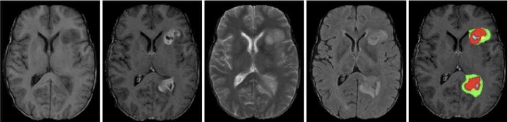

## Description
- The objective of the project is to use deep learning to diagnose tumor from MRI images.
- The project uses a 3D U-Net model able to diagnose 4 labels - background, edema, enhancing tumor and non-enhancing tumor.
- Soft dice loss is used as loss-function to optimize and offset the low performance of other traditonal optimizers due to heavy class imbalance.
- The predictions are done on patch level for a sub volume of the MRI. Finally, we combine the result of patches to obtain a full MRI scan result.

# What is an MRI?
Magnetic resonance imaging (MRI) is an advanced imaging technique that is used to observe a variety of diseases and parts of the body.
Neural networks can analyze these images individually (as a radiologist would) or combine them into a single 3D volume to make predictions.
At a high level, MRI works by measuring the radio waves emitting by atoms subjected to a magnetic field. 
We have built a multiclass segmentation model which identifies 3 abnormalities in an image: Edemas, non-enhancing tumors and enhancing tumors.

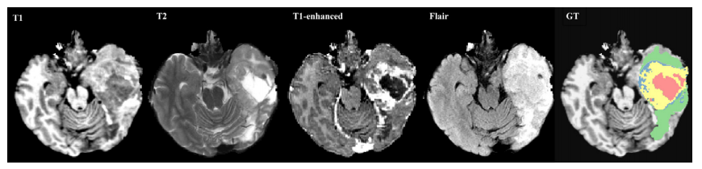

# Data preprocessing:
- In this project, I would be using data from the [Decathlon 10 challenge](https://decathlon-10.grand-challenge.org/)
- The dataset is stored in the [NifTI-1 format](https://nifti.nimh.nih.gov/nifti-1/) and we will be using the [NiBabel library](https://github.com/nipy/nibabel) to interact with the files. Each training sample is composed of two separate files:
- The first file is an image file containing a 4D array of MR image in the shape of (240, 240, 155, 4). The second file in each training example is a label file containing a 3D array with the shape of (240, 240, 155). 
- The integer values in this array indicate the "label" for each voxel in the corresponding image files:
  - 0: Background. 
  - 1: Edema.
  - 2: Non-enhancing tumor.
  - 3: Enhancing tumor.
- First generate "patches" of our data which you can think of as sub-volumes of the whole MR images. 
- The reason that we are generating patches is because a network that can process the entire volume at once will simply not fit inside our current environment's memory. Therefore we will be using this common technique to generate spatially consistent sub-volumes of our data, which can be fed into our network.
- Specifically, I generated randomly sampled sub-volumes of shape [160, 160, 16] from the images.
- Given that the values in MR images cover a very wide range, standardize the values to have a mean of zero and standard deviation of 1.
- The color corresponds to each class:
  - Red is edema.
  - Blue is enhancing tumor.
  - Green is non enhancing tumor.

# U-Net highlights:
- U-Net is a convolutional neural network that was developed for biomedical image segmentation at the Computer Science Department of the University of Freiburg The network is based on the fully convolutional network and its architecture was modified and extended to work with fewer training images and to yield more precise segmentations.
- U-Net was created by Olaf Ronneberger, Philipp Fischer, Thomas Brox in 2015 at the paper [“U-Net: Convolutional Networks for Biomedical Image Segmentation"](https://arxiv.org/pdf/1505.04597.pdf) It's an improvement and development of FCN: Evan Shelhamer, Jonathan Long, Trevor Darrell (2014). ["Fully convolutional networks for semantic segmentation"](https://arxiv.org/pdf/1411.4038.pdf)
- The architecture contains two paths. First path is the contraction path (also called as the encoder) which is used to capture the context in the image. The encoder is just a traditional stack of convolutional and max pooling layers. The second path is the symmetric expanding path (also called as the decoder) which is used to enable precise localization using transposed convolutions.
- Thus it is an end-to-end fully convolutional network (FCN), i.e. it only contains Convolutional layers and does not contain any Dense layer because of which it can accept image of any size.

Detailed U-Net architectured as described in the paper.

# 3D U-Net model:
- The U-Net model implemented here has a depth of 4. This implies that the model will have 4 contracting(analysis) paths and 4 expanding(synthesis) paths.
- In the contracting path, each layer contains two 3x3x3 convolutions each followed by a ReLU, and then a 2x2x2 maxpooling(except the last layer).
- In the expanding path, each layer consists of an up-convolution of 2×2×2, followed by two 3×3×3 convolutions each followed by a ReLU.
- Shortcut connections from layers of equal resolution in the analysis path provide the essential high-resolution features to the synthesis path.
- In the last layer, a 1×1×1 convolution reduces the number of output channels to the number of labels which is 3, followed by a sigmoid activation layer.

# Metrics:
### Dice Similarity Coefficient 
- Aside from the architecture, one of the most important elements of any deep learning method is the choice of our loss function.A natural choice that you may be familiar with is the cross-entropy loss function.However, this loss function is not ideal for segmentation tasks due to heavy class imbalance (there are typically not many positive regions).
- A much more common loss for segmentation tasks is the Dice similarity coefficient, which is a measure of how well two contours overlap. 

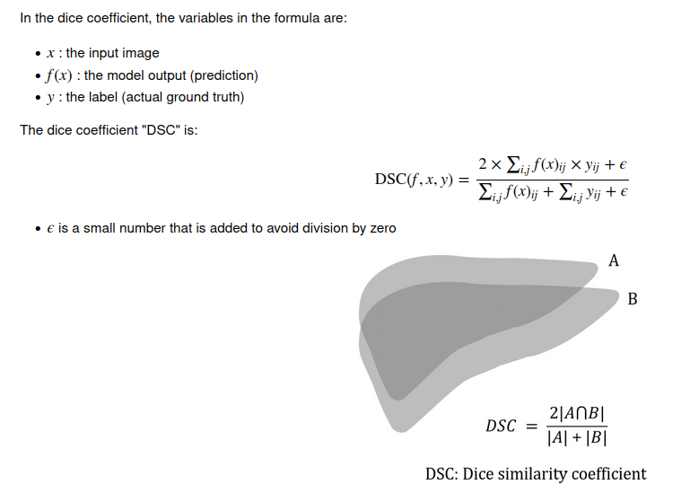

### Soft Dice Loss
- The model outputs probabilities that each pixel is, say, a tumor or not, and we want to be able to backpropagate through those outputs.
Therefore, we need an analogue of the Dice loss which takes real valued input. This is where the Soft Dice loss comes in. The formula is:

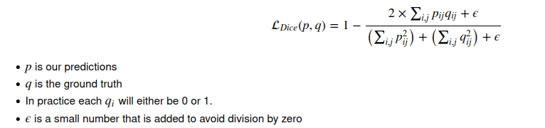

### Sensitivity and Specificity:
- The model covers some of the relevant areas, but it's definitely not perfect.
To quantify its performance, we can use per-pixel sensitivity and specificity.
Recall that in terms of the true positives, true negatives, false positives, and false negatives.

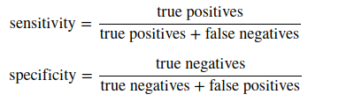

# Results:
### Patch level predictions:
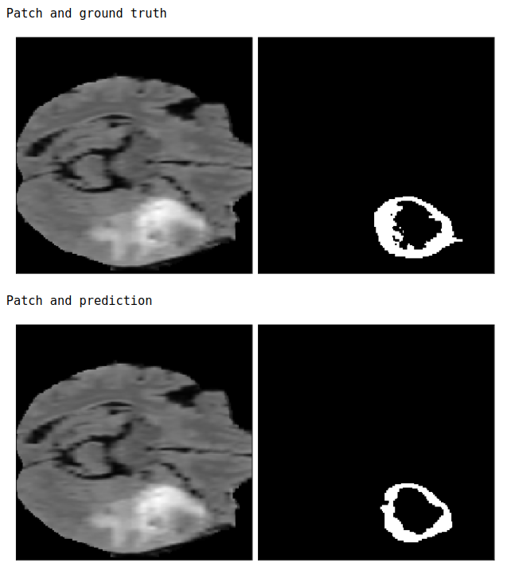

### Evaluation metrics

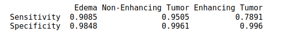

### Whole scan predictions:
- As of now, our model just runs on patches, but what we really want to see is our model's result on a whole MRI scan. 
- To do this, generate patches for the scan, then we run the model on the patches and combine the results together to get a fully labeled MR image.

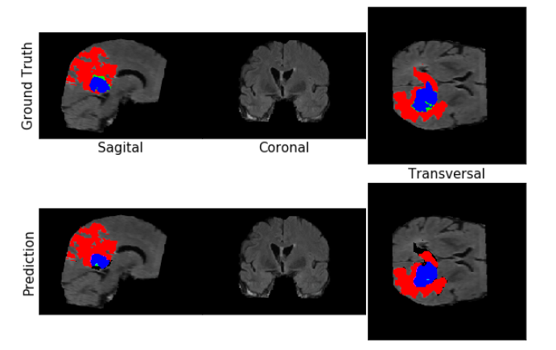

### Evaluation metrics

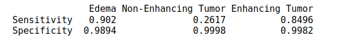

# [Chest X-Ray Analysis](https://github.com/HarshShah03325/AI-for-healthcare/tree/main/Chest%20X-Ray%20Analysis)
Diagnose 14 pathologies on Chest X-Ray using Deep Learning. Perform diagnostic interpretation using GradCAM Method

## Description
- The objective of the project is to use a deep learning model to diagnose pathologies from Chest X-Rays.
- The project uses a pretrained DenseNet-121 model able to diagnose 14 labels such as Cardiomegaly, Mass, Pneumothorax or Edema. In other words, this single model can provide binary classification predictions for each of the 14 labeled pathologies.
- Weight normalization is performed to offset the low prevalence of the abnormalities among the dataset of X-Rays (class imbalance).
- Finally the GradCAM technique is used to highlight and visualize where the model is looking, which area of interest is used to make the prediction. This is a tool which can be helpful for discovery of markers, error analysis, training and even in deployment.

# Dataset

The project uses chest x-ray images taken from the public [ChestX-ray8 dataset](https://arxiv.org/abs/1705.02315). This dataset contains 108,948 frontal-view X-ray images of 32,717 unique patients. Each image in the data set contains multiple text-mined labels identifying 14 different pathological conditions.
These in turn can be used by physicians to diagnose 8 different diseases.
For the project we have been working with a ~1000 image subset of the images.
- 875 images to be used for training.
- 109 images to be used for validation.
- 420 images to be used for testing.

The dataset includes a CSV file that provides the ground truth labels for each X-ray.

With our dataset splits ready, we can now proceed with setting up our model to consume them.
For this we will use the off-the-shelf [ImageDataGenerator](https://keras.io/preprocessing/image/) class from the Keras framework, which allows us to build a "generator" for images specified in a dataframe.
This class also provides support for basic data augmentation such as random horizontal flipping of images.We also use the generator to transform the values in each batch so that their mean is 0 and their standard deviation is 1. This will facilitate model training by standardizing the input distribution.
The generator also converts our single channel X-ray images (gray-scale) to a three-channel format by repeating the values in the image across all channels.
We will want this because the pre-trained model that we'll use requires three-channel inputs.

# DenseNet highlights

DenseNet was introduced in 2017 in an award-winning paper by Gao Huang et al. 2018 called [Densely Connected Convolutional Networks](https://arxiv.org/pdf/1608.06993.pdf). The model was able to outperform previous architectures like ResNet. 

Regardless of the architectural designs of these networks, they all try to create channels for information to flow between the initial layers and the final layers. DenseNet, with the same objective, create paths between the layers of the network. Parts of this summary are can be found in this [review](https://towardsdatascience.com/paper-review-densenet-densely-connected-convolutional-networks-acf9065dfefb).

- DenseNet key novelty:
Densenet is a convolutional network where each layer is connected to all other layers that are deeper in the network
  - The first layer is connected to the 2nd, 3rd, 4th etc.
  - The second layer is connected to the 3rd, 4th, 5th etc.

Each layer in a dense block receives feature maps from all the preceding layers, and passes its output to all subsequent layers. Feature maps received from other layers are fused through concatenation, and not through summation (like in ResNets). Extracted feature maps are continuously added together with previous ones which avoids redundant and duplicate work.

This allows the network to re-use learned information and be more efficient. Such networks require fewer layers. State of the art results are achieved with as low as 12 channel feature maps. This also means the network has fewer parameters to learn and is therefore easier to train. 
Amongst all variants, DenseNet-121 is the standard one. 

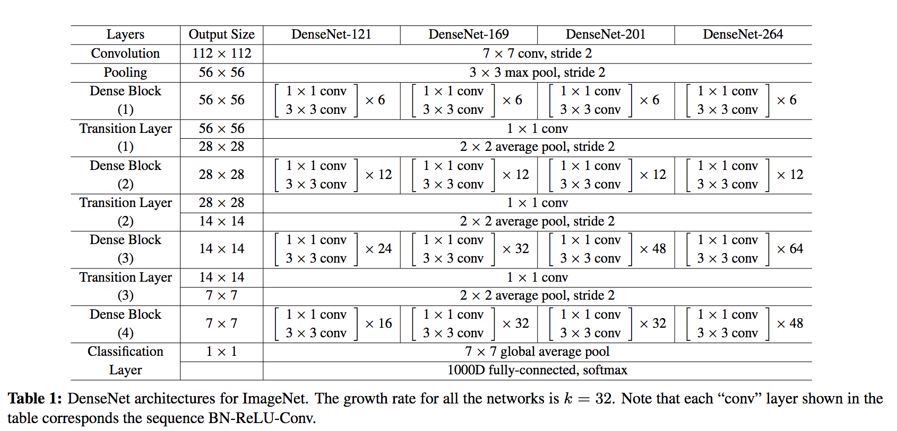

Key contributions of the DenseNet architecture:
- Alleviates vanishing gradient problem ( as networks get deeper, gradients aren’t back-propagated sufficiently to the initial layers of the network. The gradients keep getting smaller as they move backwards into the network and as a result, the initial layers lose their capacity to learn the basic low-level features)
- Stronger feature propagation
- Feature re-use
- Reduced parameter count

# DenseNet architecture

DenseNet is composed of Dense blocks. In those blocks, the layers are densely connected together: Each layer receive in input all previous layers output feature maps. The DenseNet-121 comprises 4 dense blocks, which themselves comprise 6 to 24 dense layers.
-	Dense block: 
A dense block comprises n dense layers. These dense layers are connected such that each dense layer receives feature maps from all preceding layers and passes it’s feature maps to all subsequent layers. The dimensions of the features (width, height) stay the same in a dense block.

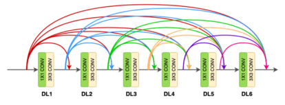

-	Dense layer: 
Each dense-layer consists of 2 convolutional operations.
    - 1 X 1 CONV (conventional conv operation for extracting features)
    - 3 X 3 CONV (bringing down the feature depth/channel count)

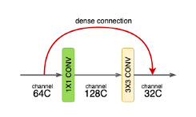

The  CONV layer corresponds to the sequence BatchNorm->ReLU->Conv. A layer has each sequence repeated twice, the first with 1x1 Convolution bottleneck producing: grow rate x 4 feature maps, the second with 3x3 convolution. The authors found that the pre-activation mode (BN and ReLU before the Conv) was more efficient than the usual post-activation mode.

The growth rate (k= 32 for DenseNet-121) defines the number of output feature maps of a layer. Basically the layers output 32 feature maps which are added to a number of 32 feature maps from previous layers. While the depth increases continuously, each layer bring back the depth to 32.

-	Transition layer: 
In between dense blocks, you find Transition layer. Instead of summing the residual like in ResNet, DenseNet concatenates all the feature maps.
A transition layer is made of: Batch Normalization -> 1x1 Convolution -> Average pooling.
Transition layers between two dense blocks ensure the down-sampling role (x and y dimensions halved), essential to CNN. Transition layers also compress the feature map and reduce the channels by half. This contributes to the compactness of the network.

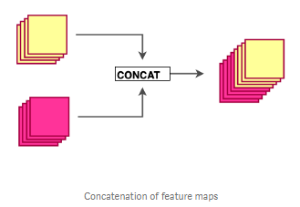

Although Concatenating generates a lot of input channels, DenseNet’s convolution generates a low number of feature maps (The authors recommend 32 for optimal performance but world-class performance was achieved with only 12 output channels).

Key benefits:
-	Compactness. DenseNet-201 with 20M parameters yields similar validation error as a 101-layer ResNet with 45M parameters.
-	The learned features are non-redundant as they are all shared through a common knowledge. 
-	Easier to train because the gradient is flowing back more easily thanks to the short connections.

# Model settings

In this project, the model uses 320 x 320 X-Rays images and outputs predictions for each of the 14 pathologies as illustrated below on a sample image. 

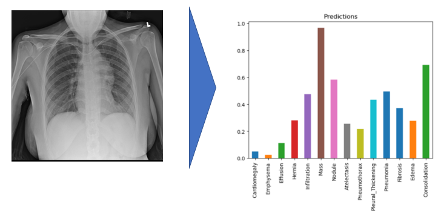

# Result
I used a pre-trained model which performance can be evaluated using the ROC curve shown at the bottom. The best results are achieved for Cardiomegaly (0.9 AUC), Edema (0.86) and Mass (0.82). Ideally we want to be significantly closer to 1. You can check out below the performance from the ChexNeXt paper and their model as well as radiologists on this dataset.

Looking at unseen X-Rays, the model correctly predicts the predominant pathology, generating a somehow accurate diagnotic, highlighting the key region underlying its predictions. In addition to the main diagnostic (highest prediction), the model also predicts secondary issues similarly to what a radiologist would comment as part of his analysis. This can be either false positive from noise captured in the X-rays or cumulated pathologies.

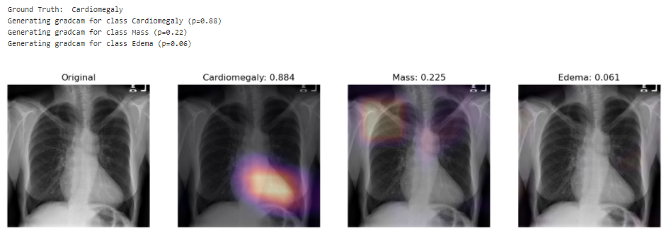

The model correctly predicts Cardiomegaly and absence of mass or edema. The probability for mass is higher, and we can see that it may be influenced by the shapes in the middle of the chest cavity, as well as around the shoulder.

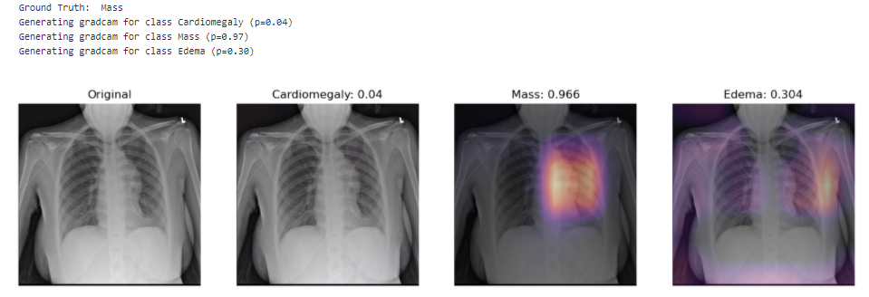

The model picks up the mass near the center of the chest cavity on the right. Edema has a high score for this image, though the ground truth doesn't mention it.

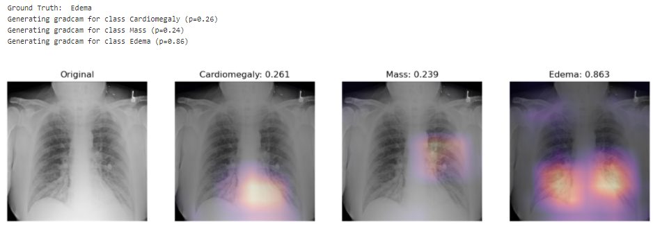

Here the model correctly picks up the signs of edema near the bottom of the chest cavity. We can also notice that Cardiomegaly has a high score for this image, though the ground truth doesn't include it. This visualization might be helpful for error analysis; for example, we can notice that the model is indeed looking at the expected area to make the prediction.

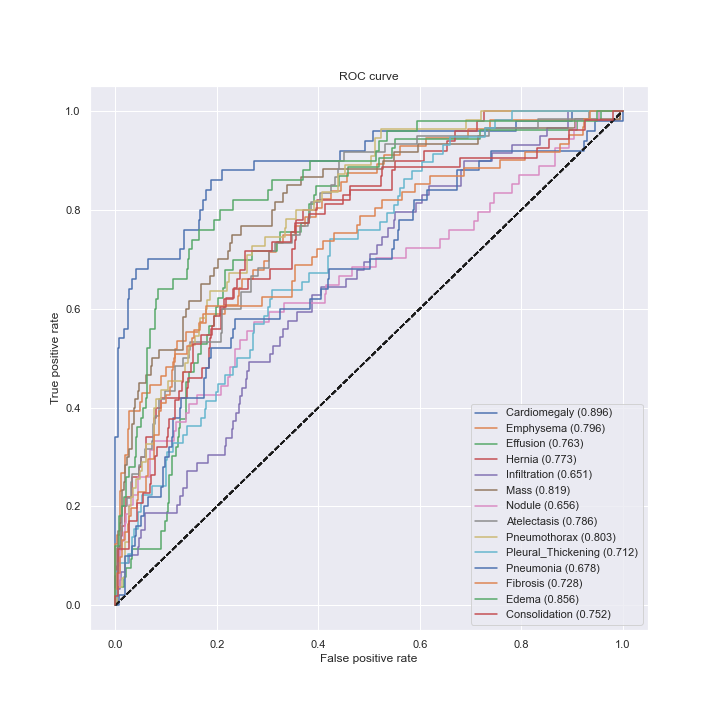

# [Risk prediction Models](https://github.com/HarshShah03325/AI-for-healthcare/tree/main/Risk%20Models)

## Description:
- The objetive of this project is to predict the 10-year risk of death of individuals based on 18 different medical factors such as age, gender, systolic blood pressure, BMI etc.
- Two types of models were used : Linear model and random forest classifier model.
- Finally, I compared different methods for both models using concordance index(c_index).

# Data exploration:
- For this project, I will be using the NHANES I epidemiology dataset.
- Looking at our training and validation data, it is conclusive that some of the data is missing: some values in the output of the previous cell are marked as NaN
("not a number"). Missing data is a common occurrence in data analysis, that can be due to a variety of reasons, such as measuring instrument malfunction, 
respondents not willing or not able to supply information, and errors in the data collection process.

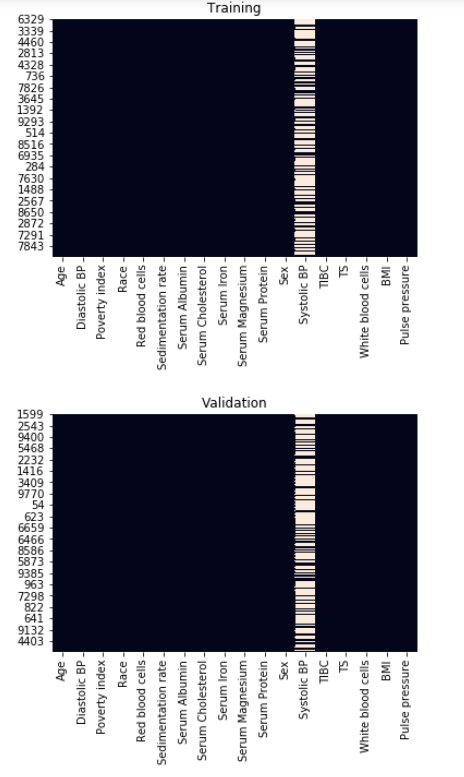

- For each feature, represented as a column, values that are present are shown in black, and missing values are set in a light color.
From this plot, we can see that many values are missing for systolic blood pressure (Systolic BP).

### Imputation:
- Seeing that our data is not missing completely at random, we can handle the missing values by replacing them with substituted values based on the 
other values that we have. This is known as imputation.
- The first imputation strategy that we will use is **mean substitution**: we will replace the missing values for each feature with the mean of the available values. 
- Next, we will apply another imputation strategy, known as **multivariate feature imputation,** using scikit-learn's IterativeImputer class.
With this strategy, for each feature that is missing values, a regression model is trained to predict observed values based on all of the other features, 
and the missing values are inferred using this model. As a single iteration across all features may not be enough to impute all missing values, 
several iterations may be performed, hence the name of the class IterativeImputer.

# Libraries:

- **shap** is a library that explains predictions made by machine learning models.
- **sklearn** is one of the most popular machine learning libraries.
- **itertools** allows us to conveniently manipulate iterable objects such as lists.
- **pydotplus** is used together with IPython.display.Image to visualize graph structures such as decision trees.
- **numpy** is a fundamental package for scientific computing in Python.
- **pandas** is what we'll use to manipulate our data.
- **seaborn** is a plotting library which has some convenient functions for visualizing missing data.
- **matplotlib** is a plotting library.

# Linear model:
- Linear regression is an appropriate analysis to use for predicting the risk value using multiple features. 
- It is used to find the best fitting model to describe the relationship between a set of features 
(also referred to as input, independent, predictor, or explanatory variables) and an outcome value
(also referred to as an output, dependent, or response variable).
- It is necessary transform the data so that the distributions are closer to standard normal distributions. First, remove some of the skew from the 
distribution by using the log transformation. Then "standardize" the distribution so that it has a mean of zero and standard deviation of 1.

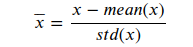

### Adding interactions:
- One possible way to improve the model is by adding interactions of the features.
- Interactions means combining two features by multiplying values of each row.
- I have tried to add all the interactions possible and calculate c_index to draw conclusions.

# Random forest classifier model:
- Random forests combine predictions from different decision trees to create a robust classifier.
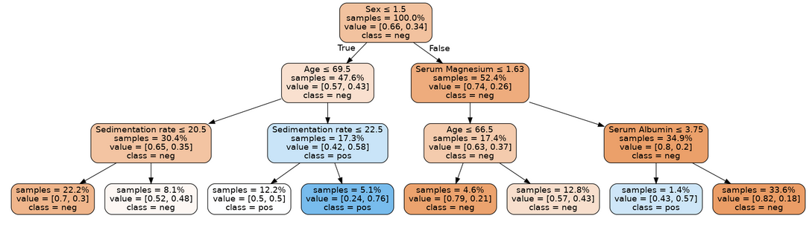
Decision tree classifier.
- The fundamental concept behind random forest is a simple but powerful one — the wisdom of crowds. 
In data science speak, the reason that the random forest model works so well is:
**A large number of relatively uncorrelated models (trees) operating as a committee will outperform any of the individual constituent models.**
- It is important to tune (or optimize) the hyperparameters, to find a model that both has good predictive performance and minimizes overfitting. The hyperparameters chosen to adjust would be:
  - **n_estimators:** the number of trees used in the forest.
  - **max_depth:** the maximum depth of each tree.
  - **min_samples_leaf:** the minimum number (if int) or proportion (if float) of samples in a leaf.

# Result Predictions:
- Concordance index(c_index) is used to evaluate risk model classifiers.The c-index measures the discriminatory power of a risk score.
- Intuitively, a higher c-index indicates that the model's prediction is in agreement with the actual outcomes of a pair of patients.
    The formula for the c-index is:
    
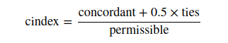
- A permissible pair is a pair of patients who have different outcomes.
- A concordant pair is a permissible pair in which the patient with the higher risk score also has the worse outcome.
- A tie is a permissible pair where the patients have the same risk score.
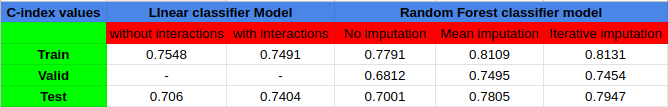

# Explainations using SHAP:
- Using a random forest has improved results, but there is loss of the natural interpretability of trees. 
- SHAP (SHapley Additive exPlanations), is a cutting edge method that explains predictions made by black-box machine learning models (i.e. models which are too complex to be understandable by humans as is).
- Given a prediction made by a machine learning model, SHAP values explain the prediction by quantifying the additive importance of each feature to the prediction. SHAP values have their roots in cooperative game theory, where Shapley values are used to quantify the contribution of each player to the game.
- Although it is computationally expensive to compute SHAP values for general black-box models, in the case of trees and forests there exists a fast polynomial-time algorithm. For more details, see the [TreeShap paper.](https://arxiv.org/pdf/1802.03888.pdf)

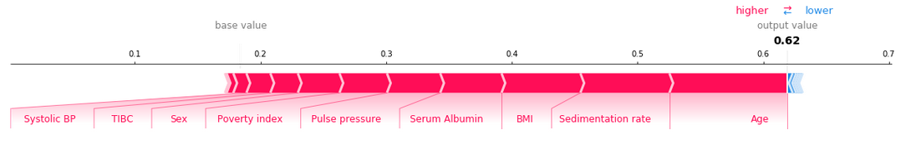
The red sections on the left are features which push the model towards the final prediction in the positive direction (i.e. a higher Age increases the predicted risk).
The blue sections on the right are features that push the model towards the final prediction in the negative direction (if an increase in a feature leads to a lower risk, it will be shown in blue).

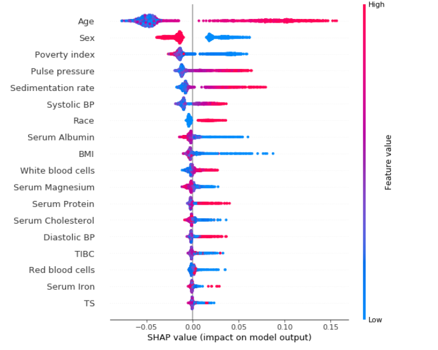

It can be clearly observed that being a woman (sex = 2.0, as opposed to men for which sex = 1.0) has a negative SHAP value, meaning that it reduces the risk of dying within 10 years. High age and high systolic blood pressure have positive SHAP values, and are therefore related to increased mortality.
Features interact using dependence plots. These plot the SHAP value for a given feature for each data point, and color the points in using the value for another feature. This lets us begin to explain the variation in SHAP value for a single value of the main feature.

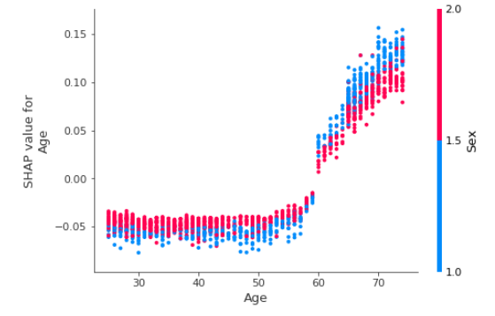 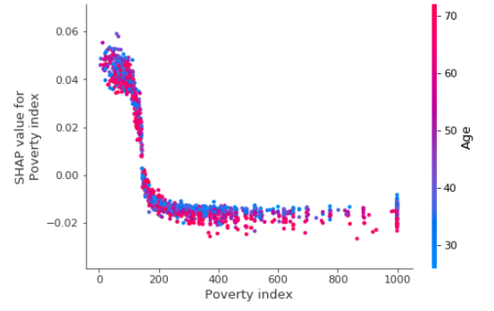

- Age > 50 is generally bad (positive SHAP value), being a woman generally reduces the impact of age. This makes sense since we know that women generally live longer than men.
- The impact of poverty index drops off quickly, and for higher income individuals age begins to explain much of variation in the impact of poverty index.

