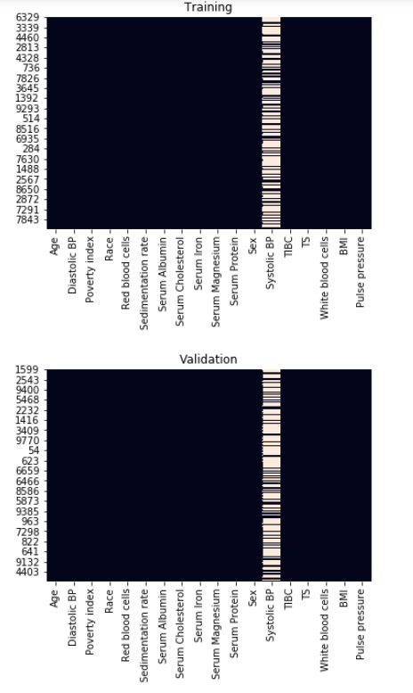
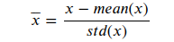
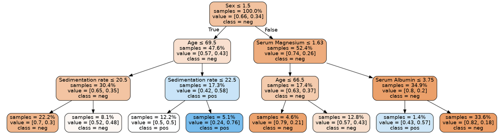
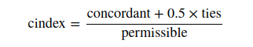
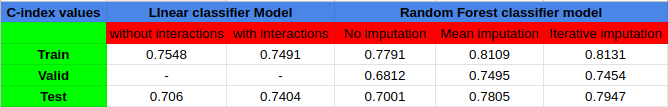
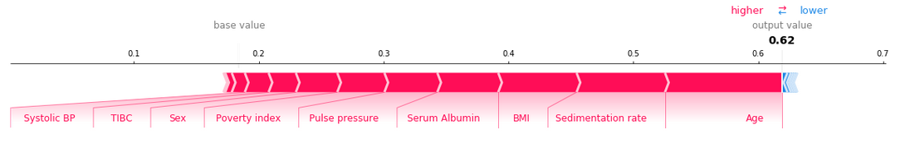
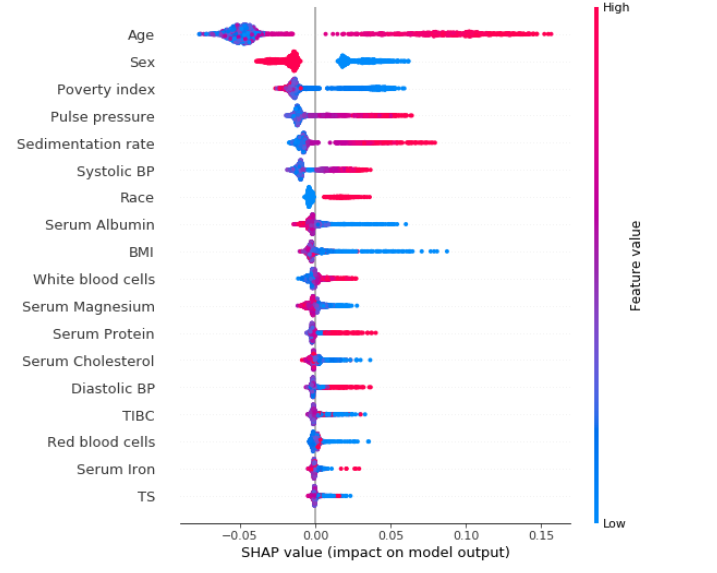
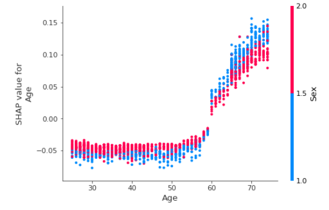
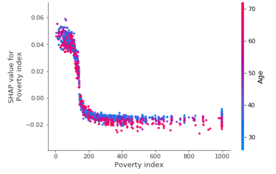

# Health Risk prediction models

# Project description:
- The objetive of this project is to predict the 10-year risk of death of individuals based on 18 different medical factors such as age, gender, systolic blood pressure, BMI etc.
- Two types of models were used : Linear model and random forest classifier model.
- Finally, I compared different methods for both models using concordance index(c_index).

# Data exploration:
- For this project, I will be using the NHANES I epidemiology dataset.
- Looking at our training and validation data, it is conclusive that some of the data is missing: some values in the output of the previous cell are marked as NaN
("not a number"). Missing data is a common occurrence in data analysis, that can be due to a variety of reasons, such as measuring instrument malfunction, 
respondents not willing or not able to supply information, and errors in the data collection process.

- For each feature, represented as a column, values that are present are shown in black, and missing values are set in a light color.
From this plot, we can see that many values are missing for systolic blood pressure (Systolic BP).

### Imputation:
- Seeing that our data is not missing completely at random, we can handle the missing values by replacing them with substituted values based on the 
other values that we have. This is known as imputation.
- The first imputation strategy that we will use is **mean substitution**: we will replace the missing values for each feature with the mean of the available values. 
- Next, we will apply another imputation strategy, known as **multivariate feature imputation,** using scikit-learn's IterativeImputer class.
With this strategy, for each feature that is missing values, a regression model is trained to predict observed values based on all of the other features, 
and the missing values are inferred using this model. As a single iteration across all features may not be enough to impute all missing values, 
several iterations may be performed, hence the name of the class IterativeImputer.

# Libraries:

- **shap** is a library that explains predictions made by machine learning models.
- **sklearn** is one of the most popular machine learning libraries.
- **itertools** allows us to conveniently manipulate iterable objects such as lists.
- **pydotplus** is used together with IPython.display.Image to visualize graph structures such as decision trees.
- **numpy** is a fundamental package for scientific computing in Python.
- **pandas** is what we'll use to manipulate our data.
- **seaborn** is a plotting library which has some convenient functions for visualizing missing data.
- **matplotlib** is a plotting library.

# Linear model:
- Linear regression is an appropriate analysis to use for predicting the risk value using multiple features. 
- It is used to find the best fitting model to describe the relationship between a set of features 
(also referred to as input, independent, predictor, or explanatory variables) and an outcome value
(also referred to as an output, dependent, or response variable).
- It is necessary transform the data so that the distributions are closer to standard normal distributions. First, remove some of the skew from the 
distribution by using the log transformation. Then "standardize" the distribution so that it has a mean of zero and standard deviation of 1.

### Adding interactions:
- One possible way to improve the model is by adding interactions of the features.
- Interactions means combining two features by multiplying values of each row.
- I have tried to add all the interactions possible and calculate c_index to draw conclusions.

# Random forest classifier model:
- Random forests combine predictions from different decision trees to create a robust classifier.

Decision tree classifier.
- The fundamental concept behind random forest is a simple but powerful one — the wisdom of crowds. 
In data science speak, the reason that the random forest model works so well is:
**A large number of relatively uncorrelated models (trees) operating as a committee will outperform any of the individual constituent models.**
- It is important to tune (or optimize) the hyperparameters, to find a model that both has good predictive performance and minimizes overfitting. The hyperparameters chosen to adjust would be:
  - **n_estimators:** the number of trees used in the forest.
  - **max_depth:** the maximum depth of each tree.
  - **min_samples_leaf:** the minimum number (if int) or proportion (if float) of samples in a leaf.

# Results:
- Concordance index(c_index) is used to evaluate risk model classifiers.The c-index measures the discriminatory power of a risk score.
- Intuitively, a higher c-index indicates that the model's prediction is in agreement with the actual outcomes of a pair of patients.
    The formula for the c-index is:

- A permissible pair is a pair of patients who have different outcomes.
- A concordant pair is a permissible pair in which the patient with the higher risk score also has the worse outcome.
- A tie is a permissible pair where the patients have the same risk score.

# Explainations using SHAP:
- Using a random forest has improved results, but there is loss of the natural interpretability of trees. 
- SHAP (SHapley Additive exPlanations), is a cutting edge method that explains predictions made by black-box machine learning models (i.e. models which are too complex to be understandable by humans as is).
- Given a prediction made by a machine learning model, SHAP values explain the prediction by quantifying the additive importance of each feature to the prediction. SHAP values have their roots in cooperative game theory, where Shapley values are used to quantify the contribution of each player to the game.
- Although it is computationally expensive to compute SHAP values for general black-box models, in the case of trees and forests there exists a fast polynomial-time algorithm. For more details, see the [TreeShap paper.](https://arxiv.org/pdf/1802.03888.pdf)

The red sections on the left are features which push the model towards the final prediction in the positive direction (i.e. a higher Age increases the predicted risk).
The blue sections on the right are features that push the model towards the final prediction in the negative direction (if an increase in a feature leads to a lower risk, it will be shown in blue).

It can be clearly observed that being a woman (sex = 2.0, as opposed to men for which sex = 1.0) has a negative SHAP value, meaning that it reduces the risk of dying within 10 years. High age and high systolic blood pressure have positive SHAP values, and are therefore related to increased mortality.
Features interact using dependence plots. These plot the SHAP value for a given feature for each data point, and color the points in using the value for another feature. This lets us begin to explain the variation in SHAP value for a single value of the main feature.

 

- Age > 50 is generally bad (positive SHAP value), being a woman generally reduces the impact of age. This makes sense since we know that women generally live longer than men.
- The impact of poverty index drops off quickly, and for higher income individuals age begins to explain much of variation in the impact of poverty index.

